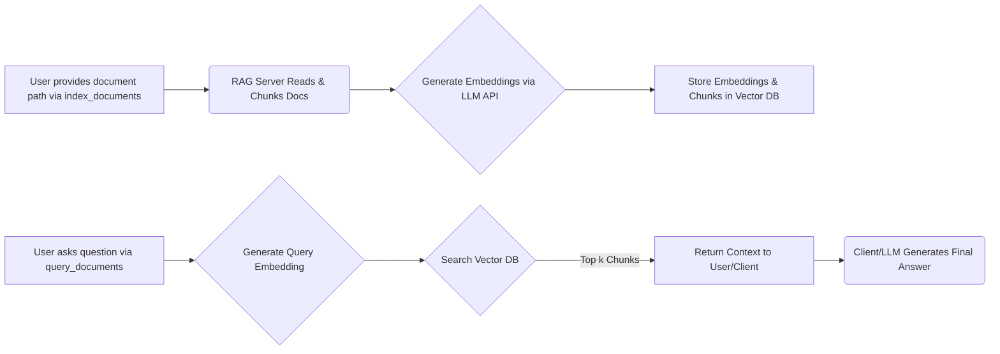

# mcp-rag-server - RAG MCP Server

[](https://www.npmjs.com/package/mcp-rag-server)
[](LICENSE)

A Model Context Protocol server enabling Retrieval Augmented Generation (RAG) capabilities. This server allows Large Language Models to answer questions based on the content of your documents by indexing them and retrieving relevant information.

## MCP Server Usage

This package is designed to be used as an MCP server with clients like Claude Desktop. Here's how to configure it:

### Basic Configuration

Add this to your MCP client configuration:

```json
{
  "mcpServers": {
    "rag": {
      "command": "npx",
      "args": ["-y", "mcp-rag-server"]
    }
  }
}
```

_Note: Ensure the required environment variables are set in the environment where the MCP client runs this command._

### Advanced Configuration

For custom settings:

```json
{
  "mcpServers": {
    "rag": {
      "command": "npx",
      "args": ["-y", "mcp-rag-server"],
      // Example of passing environment variables if your client supports it
      "env": {
        "BASE_LLM_API": "http://your-llm-api:11434/v1",
        "LLM_API_KEY": "your_api_key",
        "EMBEDDING_MODEL": "your_embedding_model:latest",
        "VECTOR_STORE_PATH": "/path/to/your/vector_store",
        "CHUNK_SIZE": "1000"
      }
    }
  }
}
```

_Note: Passing environment variables via client configuration depends on the client's capabilities. Setting them in the system environment is generally recommended._

## Installation Options

### As Global Command

```bash
npm install -g mcp-rag-server
```

Then use in your MCP config (ensure environment variables are set):

```json
{
  "mcpServers": {
    "rag": {
      "command": "mcp-rag-server"
    }
  }
}
```

### From Source

1.  Clone this repository
2.  Install dependencies:
    ```bash
    npm install
    ```
3.  Build:
    ```bash
    npm run build
    ```
4.  Run (ensure environment variables are set):
    ```bash
    npm start
    ```

## Available RAG Tools

The server provides these MCP-accessible RAG operations:

- `index_documents`: Index documents from a specified path (`.txt`, `.md`, `.json`, `.jsonl`, `.csv`).
- `query_documents`: Query indexed documents using RAG.
- `remove_document`: Remove a specific document from the index by its path.
- `remove_all_documents`: Remove all documents from the index (requires confirmation).
- `list_documents`: List all document paths currently in the index.

## How RAG Works

This MCP server implements Retrieval Augmented Generation (RAG) to answer questions based on your documents. Here's the process:

1.  **Indexing:** Use `index_documents` to provide a path to a file or directory containing supported documents (`.txt`, `.md`, `.json`, `.jsonl`, `.csv`).
2.  **Chunking & Embedding:** The server reads the documents, splits them into manageable chunks (configurable via `CHUNK_SIZE`), and generates vector embeddings for each chunk using the specified `EMBEDDING_MODEL` via the `BASE_LLM_API`.
3.  **Storing:** These embeddings and the corresponding text chunks are stored in a local vector database (location specified by `VECTOR_STORE_PATH`).
4.  **Querying:** Use `query_documents` with your question. The server generates an embedding for the query.
5.  **Searching:** It searches the vector database for the `k` document chunks whose embeddings are most similar to the query embedding.
6.  **Contextualization:** The retrieved chunks are formatted and returned as context. An external LLM (like the one used in your chat client) can then use this context along with the original query to generate a comprehensive answer.



## Environment Variables

To configure the server, you need to set the following environment variables in your system. They can also potentially be passed via the MCP client configuration if supported (see Advanced Configuration).

- `BASE_LLM_API`: (Required) The base URL for the embedding API endpoint (compatible with OpenAI embeddings API format).
- `LLM_API_KEY`: (Optional) Your API key if the embedding endpoint requires authentication.
- `EMBEDDING_MODEL`: (Required) Specifies the embedding model name compatible with your `BASE_LLM_API`.
- `VECTOR_STORE_PATH`: (Optional) The directory path where the vector store database will be saved.
  - Default: `"./vector_store"`
- `CHUNK_SIZE`: (Optional) The target size (in characters) for splitting documents into chunks during indexing.
  - Default: `500`

These variables are crucial for connecting to the embedding service and managing the vector store.

### Configuration Examples for Embedding Providers

Here's how to set the key variables for common providers:

**1. Ollama (Local)**

- Ensure Ollama is running and the desired embedding model is pulled (e.g., `ollama pull nomic-embed-text`).
- `BASE_LLM_API`: `http://localhost:11434/v1` (or your Ollama server address)
- `LLM_API_KEY`: (Leave empty or unset)
- `EMBEDDING_MODEL`: `nomic-embed-text` (or the specific model name you pulled, e.g., `mxbai-embed-large`)

**2. LM Studio (Local)**

- Start the LM Studio local server and load an embedding model.
- `BASE_LLM_API`: `http://localhost:1234/v1` (or the address shown in LM Studio Server logs)
- `LLM_API_KEY`: (Leave empty or unset)
- `EMBEDDING_MODEL`: The model identifier shown in LM Studio (this might vary, check the server logs or UI). Often, it might just need a placeholder like `lm-studio-model` if the server handles the loaded model automatically for the `/embeddings` endpoint, but verify with LM Studio documentation.

**3. OpenAI API**

- `BASE_LLM_API`: `https://api.openai.com/v1`
- `LLM_API_KEY`: `YOUR_OPENAI_API_KEY` (Replace with your actual key)
- `EMBEDDING_MODEL`: `text-embedding-3-small`, `text-embedding-3-large`, or `text-embedding-ada-002`

**4. OpenRouter**

- `BASE_LLM_API`: `https://openrouter.ai/api/v1`
- `LLM_API_KEY`: `YOUR_OPENROUTER_API_KEY` (Replace with your actual key)
- `EMBEDDING_MODEL`: The specific model identifier from OpenRouter, e.g., `openai/text-embedding-ada-002`, `jina-ai/jina-embeddings-v2-base-en`, etc. (Check their documentation for available embedding models).

**5. Google Gemini (via OpenAI Compatibility Endpoint)**

- Follow Google's instructions to enable the OpenAI compatibility endpoint for your Gemini API key.
- `BASE_LLM_API`: `https://generativelanguage.googleapis.com/v1beta` (Verify this endpoint in Google's documentation)
- `LLM_API_KEY`: `YOUR_GEMINI_API_KEY` (Replace with your actual key)
- `EMBEDDING_MODEL`: `embedding-001` (or the specific model name provided by Google for the compatibility endpoint, e.g., `models/embedding-001`)

**Important:** Always refer to the specific provider's documentation for the correct API endpoint, model names, and authentication requirements. The server assumes an OpenAI-compatible `/embeddings` endpoint.

## Development

### Prerequisites

- Node.js (Check `package.json` for version requirements)
- npm

### Building

```bash
npm run build
```

### Testing

(Add testing instructions if/when tests are implemented)

```bash
# npm test
```

## Contributing

Pull requests are welcome. For major changes, please open an issue first to discuss proposed changes.

## License

[MIT](LICENSE)
