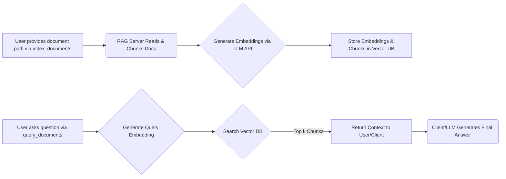

# mcp-rag-server - RAG MCP Server

[](https://www.npmjs.com/package/mcp-rag-server)
[](LICENSE)
[](package.json)

mcp-rag-server is a Model Context Protocol (MCP) server that enables Retrieval Augmented Generation (RAG) capabilities. It empowers Large Language Models (LLMs) to answer questions based on your document content by indexing and retrieving relevant information efficiently.

---

## Table of Contents

- [Overview](#overview)
- [Features](#features)
- [Quick Start](#quick-start)
- [MCP Server Usage](#mcp-server-usage)
  - [Basic Configuration](#basic-configuration)
  - [Advanced Configuration](#advanced-configuration)
- [Installation](#installation)
  - [From NPM](#from-npm)
  - [From Source](#from-source)
- [Available Tools](#available-tools)
- [Available Resources](#available-resources)
- [How RAG Works](#how-rag-works)
- [Environment Variables](#environment-variables)
  - [Recommended Models](#recommended-models)
  - [Default Environment Settings](#default-environment-settings)
  - [Configuration Examples](#configuration-examples)
- [Integrating with Clients](#integrating-with-clients)
  - [Common MCP Client Guides](#common-mcp-client-guides)
    - [Using with Cline](#using-with-cline)
    - [Using with Cursor](#using-with-cursor)
    - [Using with Claude Client](#using-with-claude-client)
    - [Using with Windsurf](#using-with-windsurf)
  - [Example Chat Conversation](#example-chat-conversation)
- [Troubleshooting](#troubleshooting)
- [Development](#development)
- [Contributing](#contributing)
- [License](#license)

---

## Features

- Document indexing for various file formats (TXT, MD, JSON, CSV)
- Customizable chunk sizes for document processing
- Support for multiple embedding providers (Ollama, OpenAI, etc.)
- Local vector store for efficient retrieval
- MCP protocol integration for seamless AI agent usage

## Quick Start

1. Install the package:

```bash
npm install -g mcp-rag-server
```

2. Set required environment variables:

```bash
export BASE_LLM_API=http://localhost:11434/v1
export EMBEDDING_MODEL=granite-embedding-278m-multilingual-Q6_K-1743674737397:latest
```

3. Start the server:

```bash
mcp-rag-server
```

---

## Overview

mcp-rag-server allows you to seamlessly integrate RAG functionalities into your applications. It works by:

- **Indexing:** Parsing documents and splitting them into manageable chunks.
- **Embedding:** Generating vector embeddings for each text chunk.
- **Querying:** Matching query embeddings with stored document chunks to retrieve context.

This enables downstream LLMs (via MCP clients like Claude Desktop) to generate contextually relevant responses.

---

## MCP Server Usage

### Basic Configuration

Integrate the server with your MCP client by adding the following to your configuration:

```json
{
  "mcpServers": {
    "rag": {
      "command": "npx",
      "args": ["-y", "mcp-rag-server"]
    }
  }
}
```

> **Note:** Ensure that the required environment variables are set in the environment where your MCP client runs the command.

### Advanced Configuration

For custom settings, including environment variables:

```json
{
  "mcpServers": {
    "rag": {
      "command": "npx",
      "args": ["-y", "mcp-rag-server"],
      "env": {
        "BASE_LLM_API": "http://localhost:11434/v1",
        "LLM_API_KEY": "",
        "EMBEDDING_MODEL": "granite-embedding-278m-multilingual-Q6_K-1743674737397:latest",
        "VECTOR_STORE_PATH": "/user-dir/vector_store_locate/",
        "CHUNK_SIZE": "500"
      }
    }
  }
}
```

> **Note:** Environment variable configuration via the client depends on its capabilities. System-level environment variables are generally recommended.

---

## Installation

### From NPM

```bash
npm install -g mcp-rag-server
```

### From Source

1. **Clone the Repository:**

   ```bash
   git clone https://github.com/yourusername/mcp-rag-server.git
   cd mcp-rag-server

   # Replace 'yourusername' with the actual repository owner
   ```

2. **Install Dependencies:**

   ```bash
   npm install
   ```

3. **Build the Project:**

   ```bash
   npm run build
   ```

4. **Run the Server:**

   Ensure your environment variables are set, then start the server:

   ```bash
   npm start
   ```

---

## Available Tools

This server provides the following tools via MCP protocol:

1. **embedding_documents** - Add documents from directory path or file path for RAG embedding

   - Supported file types: .json, .jsonl, .txt, .md, .csv
   - Parameters:
     - `path`: Path containing documents to index

2. **query_documents** - Query indexed documents using RAG

   - Parameters:
     - `query`: The question to search documents for
     - `k`: Number of chunks to return (default: 15)

3. **remove_document** - Remove a specific document from the index

   - Parameters:
     - `path`: Path to the document to remove

4. **remove_all_documents** - Remove all documents from the index

   - Parameters:
     - `confirm`: Must be set to true for operation to proceed

5. **list_documents** - List all document paths in the index

---

## Available Resources

The server also provides these resources:

1. **documents** (`rag://documents`) - Lists all document paths in the index

2. **document** (`rag://document/{path}`) - Gets content of a specific document

   - Parameters:
     - `path`: Document path to retrieve

3. **query-document** (`rag://query-document/{numberOfChunks}/{query}`) - Queries documents

   - Parameters:
     - `query`: Search query
     - `numberOfChunks`: Number of chunks to return (default: 15)

4. **embedding-status** (`rag://embedding/status`) - Gets current embedding status

---

## How RAG Works

The RAG process in the server consists of the following steps:

1. **Indexing:**  
   The `index_documents` tool accepts a file or directory path to begin processing.

2. **Chunking & Embedding:**  
   The server splits documents into chunks (configurable via `CHUNK_SIZE`) and generates vector embeddings using the specified `EMBEDDING_MODEL` via the `BASE_LLM_API`.

3. **Storing:**  
   The embeddings and chunks are stored in a local vector database at the path specified by `VECTOR_STORE_PATH`.

4. **Querying:**  
   When `query_documents` is called, the server generates an embedding for your query.

5. **Searching:**  
   It retrieves the top `k` document chunks that match the query.

6. **Contextualization:**  
   The retrieved chunks are returned as context to your LLM, which then generates a final answer.



---

## Environment Variables

The server relies on several environment variables. These can be set at the system level or passed via your MCP client configuration.

### Recommended Models

- For Ollama: Use `nomic-embed-text` for stable performance
- For LM Studio: You can use `granite-embedding-278m-multilingual`

### Default Environment Settings

If not explicitly set, the following defaults from the code will be used:

- **`BASE_LLM_API`** (Required)  
  The base URL for the embedding API endpoint.  
  **Default:** `http://localhost:11434/v1`

- **`LLM_API_KEY`** (Optional)  
  API key for the embedding service (if required).  
  **Default:** `""` (empty string)

- **`EMBEDDING_MODEL`** (Required)  
  The embedding model to use with the API.  
  **Default:** `granite-embedding-278m-multilingual-Q6_K-1743674737397:latest`

- **`VECTOR_STORE_PATH`** (Optional)  
  The directory path for storing the vector database.  
  **Default:** `./vector_store`

- **`CHUNK_SIZE`** (Optional)  
  The target size (in characters) for splitting documents into chunks.  
  **Default:** `500`

### Configuration Examples

#### 1. Ollama (Local)

- **Setup:**
  - Ensure Ollama is running and the desired model is pulled (e.g., `ollama pull nomic-embed-text`).
- **Variables:**
  ```bash
  BASE_LLM_API=http://localhost:11434/v1
  LLM_API_KEY=
  EMBEDDING_MODEL=nomic-embed-text
  ```

#### 2. LM Studio (Local)

- **Setup:**
  - Start the LM Studio server and load an embedding model.
- **Variables:**
  ```bash
  BASE_LLM_API=http://localhost:1234/v1
  LLM_API_KEY=
  EMBEDDING_MODEL=lm-studio-model
  ```

#### 3. OpenAI API

- **Setup:**
  - Use your OpenAI credentials.
- **Variables:**
  ```bash
  BASE_LLM_API=https://api.openai.com/v1
  LLM_API_KEY=YOUR_OPENAI_API_KEY
  EMBEDDING_MODEL=text-embedding-ada-002
  ```

#### 4. OpenRouter

- **Setup:**
  - Use your OpenRouter API key.
- **Variables:**
  ```bash
  BASE_LLM_API=https://openrouter.ai/api/v1
  LLM_API_KEY=YOUR_OPENROUTER_API_KEY
  EMBEDDING_MODEL=openai/text-embedding-ada-002
  ```

#### 5. Google Gemini (via OpenAI Compatibility Endpoint)

- **Setup:**
  - Follow Google’s instructions to enable the compatibility endpoint.
- **Variables:**
  ```bash
  BASE_LLM_API=https://generativelanguage.googleapis.com/v1beta
  LLM_API_KEY=YOUR_GEMINI_API_KEY
  EMBEDDING_MODEL=embedding-001
  ```

> **Important:** Always refer to your provider’s documentation for precise API endpoints, model names, and authentication requirements.

## Using Ollama Embedding Models

1. Install [Ollama](https://ollama.com):

```bash
curl -fsSL https://ollama.com/install.sh | sh
```

2. Pull your preferred embedding model:

```bash
ollama pull nomic-embed-text  # Recommended for general use
# or
ollama pull granite-embedding  # IBM's model
```

3. Configure `.env`:

```bash
BASE_LLM_API=http://localhost:11434/v1
EMBEDDING_MODEL=nomic-embed-text  # or granite-embedding
```

4. Start the server:

```bash
ollama serve
```

The system supports both OpenAI-style and Ollama-style embedding APIs automatically.

---

## Integrating with Clients

After setting up the MCP server, integrate it with your client (or AI agent) so that it can leverage RAG operations seamlessly.

### Configuring Your MCP Client

Ensure your client configuration includes the RAG server as shown below:

```json
{
  "mcpServers": {
    "rag": {
      "command": "npx",
      "args": ["-y", "mcp-rag-server"],
      "env": {
        "BASE_LLM_API": "http://localhost:11434/v1",
        "LLM_API_KEY": "",
        "EMBEDDING_MODEL": "granite-embedding-278m-multilingual-Q6_K-1743674737397:latest",
        "VECTOR_STORE_PATH": "./vector_store",
        "CHUNK_SIZE": "500"
      }
    }
  }
}
```

### Common MCP Client Guides

Below are configuration and usage guides for some popular MCP clients.

#### Using with Cline

Cline is a lightweight, command-line interface client for MCP.

**Configuration:**

Update your Cline configuration (typically found at `~/.cline/config.json`):

```json
{
  "mcpServers": {
    "rag": {
      "command": "npx",
      "args": ["-y", "mcp-rag-server"],
      "env": {
        "BASE_LLM_API": "http://localhost:11434/v1",
        "LLM_API_KEY": "",
        "EMBEDDING_MODEL": "granite-embedding-278m-multilingual-Q6_K-1743674737397:latest",
        "VECTOR_STORE_PATH": "./vector_store",
        "CHUNK_SIZE": "500"
      }
    }
  }
}
```

**Usage:**

Launch Cline and execute RAG operations such as document indexing (`embedding_documents`) and queries (`query_documents`) directly from your terminal.

#### Using with Cursor

Cursor offers an interactive environment for MCP operations.

**Configuration:**

Edit the Cursor configuration file (commonly located at `~/.cursor/config.json`) to include the MCP server:

```json
{
  "mcpServers": {
    "rag": {
      "command": "npx",
      "args": ["-y", "mcp-rag-server"],
      "env": {
        "BASE_LLM_API": "http://localhost:11434/v1",
        "LLM_API_KEY": "",
        "EMBEDDING_MODEL": "granite-embedding-278m-multilingual-Q6_K-1743674737397:latest",
        "VECTOR_STORE_PATH": "./vector_store",
        "CHUNK_SIZE": "500"
      }
    }
  }
}
```

**Usage:**

Start Cursor to interactively manage your documents and execute RAG operations within its user-friendly interface.

#### Using with Claude Client

Claude Client integrates RAG functionalities with Anthropic Claude's conversational interface.

**Configuration:**

Incorporate the following configuration snippet into your Claude client setup:

```json
{
  "mcpServers": {
    "rag": {
      "command": "npx",
      "args": ["-y", "mcp-rag-server"],
      "env": {
        "BASE_LLM_API": "http://localhost:11434/v1",
        "LLM_API_KEY": "",
        "EMBEDDING_MODEL": "granite-embedding-278m-multilingual-Q6_K-1743674737397:latest",
        "VECTOR_STORE_PATH": "./vector_store",
        "CHUNK_SIZE": "500"
      }
    }
  }
}
```

**Usage:**

When operating within the Claude Client, invoke RAG commands—such as indexing or querying documents—during your conversation to enrich the context and generate informed responses.

#### Using with Windsurf

Windsurf is designed for seamless, web-based interaction with MCP servers.

**Configuration:**

Add the MCP server configuration to your Windsurf settings:

```json
{
  "mcpServers": {
    "rag": {
      "command": "npx",
      "args": ["-y", "mcp-rag-server"],
      "env": {
        "BASE_LLM_API": "http://localhost:11434/v1",
        "LLM_API_KEY": "",
        "EMBEDDING_MODEL": "granite-embedding-278m-multilingual-Q6_K-1743674737397:latest",
        "VECTOR_STORE_PATH": "./vector_store",
        "CHUNK_SIZE": "500"
      }
    }
  }
}
```

**Usage:**

Launch Windsurf and access its GUI-driven RAG features. Use the interface to add documents, perform queries, and receive contextual answers powered by your MCP server.

### Example Chat Conversation

Below is an example conversation that demonstrates how an AI agent might instruct the MCP server to index documents and query the indexed documents:

**User:**  
Hey, can you add my documents for indexing? I have them stored in `/data/docs`.

**AI Agent:**  
Sure, let me index the documents from `/data/docs` now.

_([Tool Call]: The agent issues an "index_documents" command with the path `/data/docs`.)_

**AI Agent (after processing):**  
The documents have been successfully indexed.

---

**User:**  
Great! Now, could you help me find out what the main topics are in our latest report?

**AI Agent:**  
Okay, I'll query the indexed documents to retrieve context related to your report.

_([Tool Call]: The agent issues a "query_documents" command with the query "What are the main topics in our latest report?")_

**AI Agent (after processing):**  
I found some relevant context from your documents. Based on the retrieved information, the main topics include market trends, customer feedback, and upcoming product features.

---

## Troubleshooting

### Common Issues

**Error: Embedding model not found**

- Ensure your embedding model is properly installed/pulled
- Verify the model name matches exactly

**Error: Vector store permissions**

- Check write permissions for the VECTOR_STORE_PATH directory
- Ensure sufficient disk space is available

**Performance Issues**

- Reduce CHUNK_SIZE for better performance with large documents
- Consider using a more powerful embedding model

## Development

### Prerequisites

- Node.js 18+ (v18.0.0 or higher required)
- npm 9+ (v9.0.0 or higher recommended)

### Building

```bash
npm run build
```

### Testing

Run unit tests:

```bash
npm test
```

Run integration tests (requires Ollama running locally):

```bash
npm run test:integration
```

### Linting

```bash
npm run lint
```

## Contributing

We welcome contributions! Please follow these guidelines:

1. Fork the repository
2. Create a feature branch (`git checkout -b feature/your-feature`)
3. Commit your changes (`git commit -am 'Add some feature'`)
4. Push to the branch (`git push origin feature/your-feature`)
5. Open a Pull Request

Please ensure:

- Code follows existing style
- Tests are added for new features
- Documentation is updated
- Commit messages follow conventional commits

---

## License

This project is licensed under the [MIT License](LICENSE).
